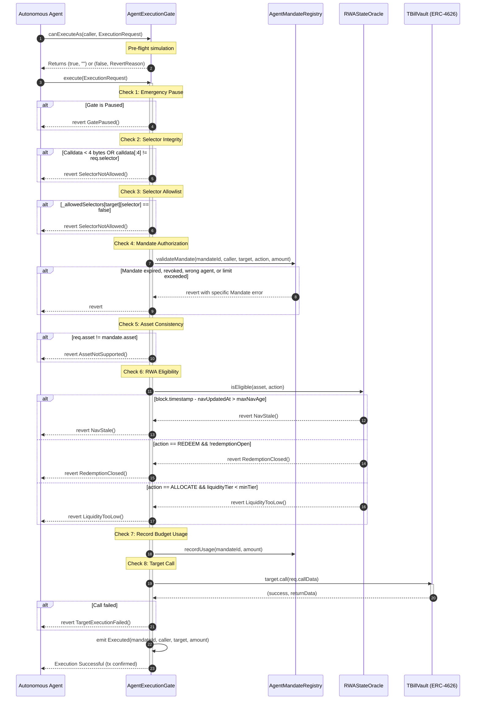

# T-BillFlow

> **"An Arbitrum-native execution layer for autonomous agents managing tokenized Treasury and RWA positions."**

[-28A0F0?logo=arbitrum&logoColor=white)](https://sepolia.arbiscan.io)
[](https://soliditylang.org/)
[-red?logo=ethereum&logoColor=white)](https://getfoundry.sh/)
[](https://python.org/)
[](https://nextjs.org/)
[](https://opensource.org/licenses/MIT)

**Live Deployment (Testnet):** [https://tbillflow.vercel.app](https://tbillflow.vercel.app)  
**Contract Verification:** Arbitrum Sepolia Block Explorer ([Arbiscan](https://sepolia.arbiscan.io/address/0xd39a16c7f36b6e103903342c0abd98fcf1f7c88d))

---

### Core Thesis: Authorization ≠ Eligibility

> **"The AI is autonomous. The authority is not."**

In autonomous on-chain finance, granting an agent cryptographic authority to transact is only half of the safety equation. Even if an off-chain agent holds an active, unexpired mandate allowing it to allocate capital, the transaction must fail closed on-chain if the underlying Real-World Asset (RWA) state is currently ineligible (e.g., Net Asset Value is stale, redemption windows are closed, or market liquidity is degraded).

T-BillFlow enforces this separation at the smart contract level: **Agent Authorization** and **RWA Eligibility** are evaluated as independent gates. If either condition fails, the on-chain execution gate blocks the transaction atomically before state transitions can occur.

---

## 1. Executive Summary

T-BillFlow is an Arbitrum-native execution and risk-containment layer designed for autonomous agents operating across tokenized Real-World Assets and short-duration Treasury vaults. 

While existing agent systems rely almost exclusively on off-chain decision-making or basic Role-Based Access Control (RBAC), T-BillFlow establishes a deterministic, dual-key verification protocol on-chain:

1. **Authorization ("What is the agent allowed to do?"):**  
   Managed by the `AgentMandateRegistry`. Verifies cryptographically signed EIP-712 mandates, enforcing hard rules on authorized agent callers, allowed target contracts, function selector masks, per-transaction budget limits (`maxTx`), cumulative lifetime caps (`maxCumulative`), and execution time windows (`validFrom` / `validUntil`).

2. **Eligibility ("Should this action proceed given the live state of the asset?"):**  
   Managed by the `RWAStateOracle`. Evaluates real-time asset conditions including NAV staleness thresholds (`maxNavAge`), institutional redemption statuses (`redemptionOpen`), and minimum liquidity tiers (`liquidityTier`).

3. **Execution Gating ("Atomic Convergence"):**  
   The `AgentExecutionGate` acts as the single trusted execution authority. It simulates the transaction (`canExecuteAs`), strictly enforces selector allowlists, checks the mandate, verifies asset consistency, queries the oracle for asset eligibility, logs budget consumption, and only then executes the target contract via low-level call.

---

## 2. The Problem

As autonomous agents begin executing automated Treasury allocations, cash management, and yield-harvesting strategies, traditional smart contract interfaces present severe systemic risks:

* **Conflation of Permission and Health:** Standard ERC-20 allowances and generic multisigs grant unconditional execution privileges. If an off-chain agent hallucinates, experiences latency, or suffers logic corruption, it may submit transactions into stale pricing environments or frozen redemption pools.
* **Stale NAV Arbitrage / Mispricing:** Traditional securities update pricing in discrete windows. If an agent executes a deposit or redemption when NAV feeds have lapsed beyond acceptable freshness windows (e.g., market holiday, weekend, or upstream feed outage), the vault faces pricing arbitrage and balance sheet distortion.
* **Operational Inflexibility:** Off-chain guardrails can be bypassed if the private key is compromised or if an external caller directly invokes the contract. Without an on-chain gate checking both the caller's mandate and the asset state atomically, protocol solvency depends entirely on the integrity of off-chain code.

---

## 3. Core Principle: Authorization ≠ Eligibility

```
┌────────────────────────────────────────────────────────┐
│               Autonomous Agent Decision                │
│    "Allocate $250,000 tBUSD into T-Bill Vault"         │
└───────────────────────────┬────────────────────────────┘
                            │
                            ▼
             AgentExecutionGate._validate()
                            │
            ┌───────────────┴───────────────┐
            ▼                               ▼
┌───────────────────────┐       ┌───────────────────────┐
│     AUTHORIZATION     │       │      ELIGIBILITY      │
│ AgentMandateRegistry  │       │    RWAStateOracle     │
├───────────────────────┤       ├───────────────────────┤
│ • Valid signature     │       │ • NAV age < 300s      │
│ • Valid timeframe     │       │ • Redemption open     │
│ • Amount ≤ $1M maxTx  │       │ • Liquidity Tier ≥ 3  │
│ • Target & action OK  │       │ • Asset supported     │
└───────────┬───────────┘       └───────────┬───────────┘
            │                               │
            └───► [ BOTH MUST PASS ] ◄──────┘
                            │
               ┌────────────┴────────────┐
               │                         │
               ▼                         ▼
         [ PASS: TRUE ]            [ ANY FAIL ]
               │                         │
               ▼                         ▼
     Target.call(calldata)         Revert with Error:
   • Record mandate usage        • NavStale()
   • Mint vault shares           • RedemptionClosed()
   • Emit Executed()             • TxLimitExceeded()
```

---

## 4. Architecture

T-BillFlow separates responsibilities into four core smart contracts deployed on Arbitrum Sepolia, supported by a deterministic off-chain monitoring agent and an institutional operator dashboard.

```mermaid
flowchart TD
    subgraph Off-Chain Environment
        User[Protocol Owner / User]
        Agent[Autonomous Rule-Based Agent]
        FRED[Federal Reserve FRED API<br/>DTB4WK Benchmark Rate]
        Custody[Institutional Attestation Feed<br/>(External Dependency)]
    end

    subgraph Arbitrum Sepolia [Arbitrum Sepolia Testnet - Chain ID: 421614]
        subgraph Core Governance & State
            Registry[AgentMandateRegistry.sol<br/>EIP-712 Mandates & Budgets]
            Oracle[RWAStateOracle.sol<br/>NAV, Staleness & Liquidity Tiers]
            Compliance[ComplianceRegistry.sol<br/>KYC & Sanction Verification]
        end

        subgraph Enforcement Authority
            Gate[AgentExecutionGate.sol<br/>Atomic Validation & Low-Level Dispatch]
        end

        subgraph Vault & Settlement
            Vault[TBillVault.sol<br/>ERC-4626 Tokenized T-Bill Vault]
            Asset[tBUSD Token<br/>Settlement Reserve (ERC-20)]
        end
    end

    subgraph Client Application
        Frontend[Next.js App Router Dashboard<br/>Wagmi v2 / Viem / React Query]
    end

    User -->|Grants EIP-712 Mandate| Registry
    FRED -.->|Live Treasury Yield| Agent
    Custody -.->|Signed Attestation| Oracle
    Agent -->|Simulates canExecuteAs| Gate
    Agent -->|Submits execute| Gate
    Frontend -->|Reads Live State / Simulates| Gate
    Frontend -->|Direct User Deposit| Vault

    Gate -->|1. Validate Mandate| Registry
    Gate -->|2. Check Asset Eligibility| Oracle
    Gate -->|3. Check Investor KYC| Compliance
    Gate -->|4. Record Budget Usage| Registry
    Gate -->|5. Low-Level Execution| Vault
    Vault -->|Transfers Asset| Asset
```

---

## 5. Execution Workflow

When an autonomous agent or operator triggers a vault transaction through the `AgentExecutionGate`, the system proceeds through an immutable, ordered sequence of verification checks:



---

## 6. Smart Contract Architecture

The on-chain system comprises modular, audit-hardened Solidity contracts (`0.8.25`).

| Contract | Role / Purpose | Main Responsibility | Key Invariant / Security Property |
|---|---|---|---|
| [`AgentExecutionGate.sol`](file:///contracts/src/AgentExecutionGate.sol) | Central Enforcement Authority | Atomic transaction validation and low-level target forwarding | No call reaches target unless mandate, selector, asset, and RWA oracle pass simultaneously. Reentrancy guarded. |
| [`AgentMandateRegistry.sol`](file:///contracts/src/AgentMandateRegistry.sol) | Delegated Authority Store | EIP-712 signature verification, time windows, and cumulative budget tracking | `used` never exceeds `maxCumulative`. Nonces prevent replay attacks. Only owner can grant/revoke. |
| [`RWAStateOracle.sol`](file:///contracts/src/RWAStateOracle.sol) | RWA State Provider | Tracks NAV, staleness limits, redemption flags, and liquidity tiers | `isEligible` reverts if `block.timestamp - navUpdatedAt > maxNavAge`. Strict provider signature validation. |
| [`TBillVault.sol`](file:///contracts/src/TBillVault.sol) | Tokenized Vault (ERC-4626) | Share accounting, direct and gate-mediated deposits / redemptions | Assets strictly match underlying reserve. Gate execution pulls from owner allowance cleanly. |
| [`ComplianceRegistry.sol`](file:///contracts/src/ComplianceRegistry.sol) | Regulatory Compliance | KYC verification, sanction screening, and jurisdictional transfer rules | Flags unauthorized wallets before gate executes asset transfers. |
| [`Types.sol`](file:///contracts/src/Types.sol) | Canonical Type Definitions | Single source of truth for bitmasks, structs, and interfaces | Prevents type mismatch across the repository. |

### Contract Details

#### 1. `AgentExecutionGate.sol`
* **Validation Order:**
  1. `paused()` status check
  2. Calldata selector integrity (`bytes4(req.callData[:4]) == req.selector`)
  3. Per-target selector allowlist (`_allowedSelectors[target][selector]`)
  4. Mandate authorization (`mandateRegistry.validateMandate(...)`)
  5. Asset consistency check (`mandate.asset == req.asset`)
  6. RWA state eligibility (`rwaOracle.isEligible(req.asset, req.action)`)
  7. Investor compliance check (`complianceRegistry.isWalletEligible(...)`)
  8. Usage recording (`mandateRegistry.recordUsage(...)` before external interaction)
  9. Low-level call dispatch (`target.call(req.callData)`)
* **Simulation:** Exposes `canExecuteAs(caller, req)` which invokes `_validate` inside an external view routine, enabling UI and agents to inspect exact revert reasons without spending gas.

#### 2. `AgentMandateRegistry.sol`
* Implements EIP-712 structured typed data signing:
  ```solidity
  bytes32 public constant MANDATE_TYPEHASH = keccak256(
      "Mandate(address agent,address asset,address allowedTarget,uint256 allowedActionsMask,uint256 maxTx,uint256 maxCumulative,uint256 validFrom,uint256 validUntil,uint256 nonce)"
  );
  ```
* Stores lifetime budget consumption (`used`). If `used + amount > maxCumulative`, it strictly reverts with `CumulativeLimitExceeded()`.
* Mandate validity windows (`validFrom <= block.timestamp <= validUntil`) are enforced against block time.

#### 3. `RWAStateOracle.sol`
* Authoritative state representation:
  ```solidity
  struct AssetState {
      uint256 nav;            // Net Asset Value (18-decimal fixed point)
      uint256 navUpdatedAt;   // Unix timestamp of last update
      bool    redemptionOpen; // Redemption gate status
      uint8   liquidityTier;  // 0 = illiquid, 1 = low, 2 = medium, 3 = high
      uint8   riskTier;       // Institutional risk tier
      bool    supported;      // Whitelist flag
      uint256 maxNavAge;      // Maximum age (seconds) before NAV is stale
  }
  ```
* Supports administrative updates, signed off-chain provider attestations (`RWAAttestation` with cryptographic ECDSA signatures), and on-chain price feed synchronization (`syncFromFeed`).

#### 4. `TBillVault.sol`
* Standard ERC-4626 implementation built using Solady's gas-optimized foundation.
* **Gate-Mediated Execution:** When `msg.sender == executionGate`, the vault transfers underlying assets from the mandate owner rather than the gate contract itself, avoiding unnecessary double-allowance requirements.
* **Allocation Representation:** Includes an `allocate(uint256 amount)` endpoint restricted to the owner or execution gate.  
  > *Clarification:* `allocate()` emits an `Allocated(amount, timestamp)` event for on-chain audit tracking; it is an internal accounting milestone and does not perform physical custodial wire settlement with the Federal Reserve or off-chain broker-dealers.

---

## 7. Security Model & Threat Matrix

| Threat Vector | Attack Scenario | On-Chain Defense Mechanism | Result |
|---|---|---|---|
| **Stale NAV Execution** | Market halts or provider feed goes offline; agent attempts deposit based on hours-old pricing. | `RWAStateOracle.isEligible()` checks `block.timestamp - navUpdatedAt <= maxNavAge`. | **Revert `NavStale()`** |
| **Redemption Freeze** | Fund manager suspends redemptions during liquidity stress; agent attempts withdrawal. | `isEligible()` checks `redemptionOpen == true` for `ACTION_REDEEM` / `WITHDRAW`. | **Revert `RedemptionClosed()`** |
| **Asset Substitution** | Attacker creates valid mandate for Asset A, but passes malicious Asset B in calldata. | `AgentExecutionGate._validate()` verifies `mandate.asset == req.asset`. | **Revert `AssetNotSupported()`** |
| **Selector Mismatch** | Agent is authorized to call `deposit`, but crafts calldata targeting `drain()` or `emergencyWithdraw()`. | Gate checks `bytes4(callData[:4]) == selector` and verifies target selector is allowlisted. | **Revert `SelectorNotAllowed()`** |
| **Mandate Overrun** | Compromised agent attempts to drain more than authorized per tx or over lifetime. | Mandate registry checks `amount <= maxTx` and `used + amount <= maxCumulative`. | **Revert `TxLimitExceeded()` or `CumulativeLimitExceeded()`** |
| **Replay / Nonce Attack** | Attacker replays previously signed EIP-712 mandate to reset spent budget. | Incremental account nonce tracked in registry; duplicate grants revert on validation. | **Revert `InvalidNonce()`** |
| **Reentrancy** | Target contract attempts to call back into `AgentExecutionGate.execute()`. | `execute()` is protected by OpenZeppelin's `nonReentrant` modifier; usage recorded prior to call. | **Revert `ReentrancyGuardReentrantCall()`** |
| **Global Emergency** | Critical vulnerability detected in downstream vault or external integration. | Contract owner invokes `setPaused(true)` on `AgentExecutionGate`. | **Revert `GatePaused()`** |

### Invariant Test Verification
The mandate registry and execution gate were subjected to stateful property-based invariant testing using Foundry:
* **Invariant:** `mandate.used <= mandate.maxCumulative` under arbitrary combinations of deposit amounts, caller addresses, and timing offsets.
* **Result:** **128,000 function calls** across 256 runs completed with **0 invariant violations**.

---

## 8. Autonomous Rule-Based Agent

The repository includes an autonomous off-chain agent located in `agent/`:

```
agent/
├── agent.py                 # Core execution loop & strategy evaluation
├── config.py                # Environment configuration & provider credentials
├── contracts.py             # Web3.py contract interfaces & ABIs
├── indexer.py               # Local event listener & indexing helper
├── monitor.py               # Health & staleness telemetry monitor
├── rwa_provider.py          # Institutional provider attestation client
├── settlement.py           # Off-chain settlement & custody tracking
└── tests/                   # 23 Pytest unit & integration tests
```

### Strategy Logic
The agent is a **rule-based autonomous execution daemon** (not an unconstrained LLM). It operates on a deterministic state machine:

1. **Benchmark Yield Check:** Polls the Federal Reserve FRED API (`DTB4WK` 4-Week Treasury Bill series) or US Treasury yield curve feeds.
2. **Strategy Trigger:** Evaluates if live Treasury yield $\ge$ `YIELD_THRESHOLD` (e.g. 5.0%). If market yield is insufficient, the agent idles.
3. **Fail-Closed Execution:** If the FRED API key is missing or the external HTTP request fails, the agent **halts and blocks execution immediately** rather than assuming default yields.
4. **On-Chain Pre-flight Simulation:** Formulates an `ExecutionRequest` and calls `gate.canExecuteAs(agent_address, req)`.
5. **Execution:** If and only if `canExecuteAs` returns `(true, "")`, the agent signs and broadcasts the transaction to the Arbitrum Sepolia network using its configured private key.

---

## 9. Frontend Architecture

The user interface is built with Next.js 14 (App Router), Wagmi v2, Viem, and TanStack React Query:

```
frontend/src/app/
├── overview/                # Protocol KPI dashboard & quick status
├── mandates/                # Live EIP-712 mandate inspector & limits
├── rwa/                     # Real-time RWA Oracle state, NAV, & staleness monitor
├── executions/              # On-chain execution gating & session transaction ledger
├── deposit/                 # Direct investor deposit with on-chain share conversion
├── portfolio/               # User share balances & underlying reserve value
├── activity/                # Historical events & protocol transactions
└── faq/                     # Architectural & operational documentation
```

### Live Data Binding
* **Dynamic ERC-4626 Share Calculation:** The deposit interface does not use hardcoded share rates. It dynamically queries `convertToShares(amount)` and `convertToAssets(shares)` directly from the live `TBillVault` contract.
* **Real-Time Gate Simulation:** The Execution page continuously invokes `canExecuteAs()` against the connected wallet, accurately reflecting whether the gate would permit or reject a proposed test payload.
* **Session Transaction Ledger:** Tracks transactions executed within the current browser session. (Historical cross-session transactions require an external indexer, transparently noted in the UI).

---

## 10. Data Sources & Reality Boundary

T-BillFlow maintains complete engineering honesty regarding testnet status, data boundaries, and third-party dependencies:

| Data Element | Reality Tier | Live Source (Today) | Failure / Edge Behavior | Production Requirement |
|---|---|---|---|---|
| **RWA NAV & Liquidity** | Real On-Chain State | `RWAStateOracle.sol` on Arbitrum Sepolia | If NAV age > 300s, Gate reverts with `NavStale()` | Institutional custodian signed attestation feed (e.g., Securitize, Ondo, Chainlink PoR) |
| **Redemption Status** | Real On-Chain State | `RWAStateOracle.isRedemptionOpen()` | If closed, Gate reverts with `RedemptionClosed()` | Real-time custodian API hook / fund administrator state |
| **Agent Mandates** | Real On-Chain State | `AgentMandateRegistry.sol` | Reverts on signature, limit, nonce, or expiry failure | Principal institutional multisig (Safe) or governance grant |
| **Vault TVL & Shares** | Real On-Chain State | `TBillVault.sol` (`totalAssets`, `balanceOf`) | Real ERC-4626 on-chain accounting | Audited tokenized Treasury smart contracts on mainnet |
| **Treasury Yield** | Live External API | Federal Reserve FRED API (`DTB4WK`) | API down $\rightarrow$ Agent logs error and halts (fail-closed) | Enterprise market data feeds (Bloomberg BVAL, Tradeweb) |
| **Transaction Indexing** | In-Memory Session | Client-side wallet session storage | Past browser sessions display empty state | Decentralized indexer (TheGraph / Goldsky Subgraph) |
| **Settlement Asset** | Testnet Reserve | `tBUSD` (ERC-20 test token on Sepolia) | Faucet-minted for protocol testing | Native Circle USDC (`0xaf88d...`) on Arbitrum One |
| **Treasury Custody** | Protocol Simulation | `TBillVault.allocate()` event emission | Does not hold real US Government paper | Regulated broker-dealer custody (BNY Mellon, State Street) |

---

## 11. Testnet Deployment (Arbitrum Sepolia)

The protocol is fully deployed and verified on **Arbitrum Sepolia** (Chain ID: `421614`).

| Contract Name | Deployed Address | Explorer Link |
|---|---|---|
| **AgentExecutionGate** | `0xd39a16c7f36b6e103903342c0abd98fcf1f7c88d` | [Arbiscan Contract](https://sepolia.arbiscan.io/address/0xd39a16c7f36b6e103903342c0abd98fcf1f7c88d) |
| **AgentMandateRegistry** | `0x221c9a9f1a6eed91642955baee3208c2fc901d1d` | [Arbiscan Contract](https://sepolia.arbiscan.io/address/0x221c9a9f1a6eed91642955baee3208c2fc901d1d) |
| **RWAStateOracle** | `0x3ec0fec36de1f05087dbda93c2335182383defed` | [Arbiscan Contract](https://sepolia.arbiscan.io/address/0x3ec0fec36de1f05087dbda93c2335182383defed) |
| **TBillVault (ERC-4626)** | `0x2f9453ece66d76431e3acbe33770c60d79adcda5` | [Arbiscan Contract](https://sepolia.arbiscan.io/address/0x2f9453ece66d76431e3acbe33770c60d79adcda5) |
| **Settlement Asset (tBUSD)** | `0xcde2fb76d39d060314231b15fd4d2719d6c2b354` | [Arbiscan Contract](https://sepolia.arbiscan.io/address/0xcde2fb76d39d060314231b15fd4d2719d6c2b354) |

### Active Mandate Identifier
```
0x2a8a21a89050bb2f5ca9e5e0591e84d6cd8516f26968d1e8421be0e2ddd28970
```

### Verified On-Chain Transaction Proof
The key mandate registration transaction confirming on-chain policy creation is permanently indexed on Arbitrum Sepolia:
* **Transaction Hash:** [`0x16067fd9f3ac4658555556f818539bd83c2f741c35d823dab4b95a11529d2c81`](https://sepolia.arbiscan.io/tx/0x16067fd9f3ac4658555556f818539bd83c2f741c35d823dab4b95a11529d2c81)
* **Block Number:** `311806269`
* **Function:** `registerMandate(...)` on `AgentMandateRegistry`
* **Status:** `SUCCESS (Status: 1)`

---

## 12. Testing & Quality Assurance

The codebase maintains rigorous automated test coverage across Solidity smart contracts, Python agent daemons, and Next.js frontend routes.

```
┌─────────────────────────────────────────────────────────────┐
│                       TEST RESULTS                          │
├────────────────────────────┬─────────────┬──────────────────┤
│ Suite                      │ Count       │ Status           │
├────────────────────────────┼─────────────┼──────────────────┤
│ Foundry Unit & Integration │ 92 tests    │ ✅ 100% Passed   │
│ Foundry Invariant Testing  │ 128k calls  │ ✅ 0 Violations  │
│ Python Agent Test Suite    │ 23 tests    │ ✅ 100% Passed   │
│ TypeScript Static Check    │ Complete    │ ✅ 0 Errors      │
│ Next.js App Route Build    │ 15 Routes   │ ✅ Compiled      │
└────────────────────────────┴─────────────┴──────────────────┘
```

### Run Foundry Contract Tests
```bash
cd contracts
forge test --summary
```
*Output Summary:*
```text
Ran 8 test suites: 93 tests passed, 0 failed, 0 skipped
- AgentExecutionGateTest: 17 passed
- AgentMandateRegistryTest: 26 passed
- MandateRegistryInvariantTest: 1 passed (128,000 calls)
- ProductionHardeningTest: 8 passed
- RWAFeedAdapterTest: 8 passed
- RWAStateOracleTest: 17 passed
- SecurityHardeningTest: 8 passed
- TBillVaultTest: 8 passed
```

### Run Python Agent Tests
```bash
# In repository root
python -m pytest agent/tests -v
```
*Output Summary:*
```text
23 passed, 0 failed in 5.88s
- test_yield_below_threshold: PASSED
- test_live_yield_unavailable_blocks_execution: PASSED
- test_settlement_manager_external_dependency: PASSED
- test_rwa_provider_production_hard_failure: PASSED
- test_production_monitor_nav_staleness: PASSED
```

---

## 13. Local Development Guide

### Prerequisites
* **Node.js:** v18.17.0+ or v20+
* **npm:** v9+
* **Python:** v3.10+
* **Foundry:** `forge`, `cast`, and `anvil` installed ([Installation Guide](https://book.getfoundry.sh/getting-started/installation))

### 1. Repository Clone & Setup
```bash
git clone https://github.com/prithiv04/T-billflow.git
cd T-billflow
```

### 2. Smart Contract Build
```bash
cd contracts
forge install
forge build
forge test
cd ..
```

### 3. Frontend Setup
```bash
cd frontend
npm install
npm run dev
```
The operator interface will be accessible at `http://localhost:3000`.

### 4. Off-Chain Agent Setup
```bash
# Set up a Python virtual environment
python -m venv venv
source venv/bin/activate  # On Windows: .\venv\Scripts\activate

# Install requirements
pip install -r agent/requirements.txt  # or: pip install web3 python-dotenv pytest requests

# Execute agent in dry-run / monitor mode
python -m agent.monitor
```

### Environment Configuration (.env)
Create a `.env` file in the project root:
```ini
# Network & RPC Endpoints
NETWORK=arbitrum_sepolia
ARBITRUM_SEPOLIA_RPC_URL=https://sepolia-rollup.arbitrum.io/rpc
QUICKNODE_SEPOLIA_RPC_URL=https://your-endpoint.arbitrum-sepolia.quiknode.pro/...

# Deployer / Agent Private Key (Never commit real private keys)
PRIVATE_KEY=0x...

# Deployed Contract Addresses (Arbitrum Sepolia)
AGENT_EXECUTION_GATE_ADDRESS=0xd39a16c7f36b6e103903342c0abd98fcf1f7c88d
AGENT_MANDATE_REGISTRY_ADDRESS=0x221c9a9f1a6eed91642955baee3208c2fc901d1d
RWA_STATE_ORACLE_ADDRESS=0x3ec0fec36de1f05087dbda93c2335182383defed
TBILL_VAULT_ADDRESS=0x2f9453ece66d76431e3acbe33770c60d79adcda5
TEST_TOKEN_ADDRESS=0xcde2fb76d39d060314231b15fd4d2719d6c2b354
MANDATE_ID=0x2a8a21a89050bb2f5ca9e5e0591e84d6cd8516f26968d1e8421be0e2ddd28970

# External Market Data Credentials (Optional for local testnet)
FRED_API_KEY=your_fred_api_key_here
NEXT_PUBLIC_WALLETCONNECT_PROJECT_ID=00000000000000000000000000000000
```

---

## 14. Repository Structure

```
T-billflow/
├── .github/
│   └── workflows/
│       └── contracts.yml       # CI automated testing & compilation
├── agent/                      # Autonomous rule-based execution agent
│   ├── agent.py                # Main agent execution loop
│   ├── config.py               # Environment configuration
│   ├── contracts.py            # Contract ABIs & Web3 bindings
│   ├── monitor.py              # Health check & telemetry monitor
│   ├── rwa_provider.py         # Institutional attestation interface
│   └── tests/                  # 23 Pytest unit tests
├── contracts/                  # Foundry smart contract project
│   ├── script/                 # Deployment scripts (Deploy.s.sol)
│   ├── src/                    # Core protocol contracts
│   │   ├── AgentExecutionGate.sol
│   │   ├── AgentMandateRegistry.sol
│   │   ├── ComplianceRegistry.sol
│   │   ├── RWAStateOracle.sol
│   │   ├── TBillVault.sol
│   │   └── Types.sol
│   ├── test/                   # 8 Foundry test suites (93 tests)
│   └── foundry.toml            # Solidity compiler configuration
├── frontend/                   # Next.js 14 Web3 application
│   ├── src/
│   │   ├── app/                # App Router pages (15 routes)
│   │   ├── components/         # Modular Web3 UI components
│   │   ├── hooks/              # Custom Wagmi contract hooks
│   │   └── lib/                # Config, constants, and ABIs
│   ├── package.json
│   └── tsconfig.json
├── scripts/                    # Shell demo & testing scripts
│   ├── demo-valid.sh           # Case 1: Valid execution demo
│   ├── demo-max-tx.sh          # Case 2: Max tx cap rejection demo
│   ├── demo-stale-nav.sh       # Case 3: Stale NAV rejection demo
│   └── demo-redemption-closed.sh # Case 4: Closed redemption rejection demo
├── .env.example                # Environment template
├── README.md                   # Authoritative repository documentation
└── LICENSE                     # MIT License
```

---

## 15. Limitations & Production-Integration Boundaries

To maintain engineering integrity, the following system boundaries are documented:

1. **Testnet Token Settlement:** The current deployment operates on Arbitrum Sepolia using `tBUSD` (a mock ERC-20 token) as settlement reserve. It does not interface with real US fiat currency or Federal Reserve wires.
2. **Oracle Attestation Dependency:** The on-chain oracle (`RWAStateOracle.sol`) enforces NAV freshness and redemption rules, but on testnet, state updates are submitted via admin script or test attestation key. Production operation requires an institutional data pipe (e.g., Chainlink Proof of Reserve or custodian API oracle).
3. **Vault Allocation Accounting:** The `allocate()` function in `TBillVault.sol` tracks simulated capital allocation through on-chain events. It does not execute legal custody transfers of physical Treasury bills.
4. **Historical Event Indexing:** The frontend tracks transactions originating within the active user session. Cross-session querying and historical analytics require integrating an external indexer (e.g., Goldsky or The Graph).
5. **Investor Accreditation & KYC:** `ComplianceRegistry.sol` provides on-chain hooks for whitelisting, but does not interface with a live KYC/AML provider on testnet.

---

## 16. Roadmap

* [x] **Phase 1: Dual-Gate Architecture**
  * EIP-712 Agent Mandate Registry with cumulative and per-tx limits.
  * RWA State Oracle enforcing NAV freshness, redemption gates, and liquidity tiers.
  * Agent Execution Gate with strict selector allowlists and atomic checks.
* [x] **Phase 2: ERC-4626 Vault Integration**
  * Gate-mediated yield vault execution.
  * Direct investor deposit and redemption support.
* [x] **Phase 3: Autonomous Rule-Based Agent**
  * Off-chain Python daemon with live FRED API yield ingestion.
  * Fail-closed pre-flight gate simulation (`canExecuteAs`).
* [x] **Phase 4: Arbitrum Sepolia Deployment & UI**
  * Contracts deployed and verified on testnet.
  * Institutional Next.js 14 dashboard with live contract bindings.
* [ ] **Phase 5: Institutional Production Integrations (Future Work)**
  * Integration with live institutional RWA attestation providers.
  * Subgraph deployment on The Graph / Goldsky for historical execution indexing.
  * Multi-asset support across tokenized short-term debt instruments.
  * Formal verification of core gate invariants.
  * Arbitrum One mainnet deployment.

---

## 17. Contributing

Contributions are welcome from blockchain engineers, agent developers, and RWA researchers.

1. **Fork the repository**
2. **Create a feature branch:** `git checkout -b feature/your-feature-name`
3. **Commit your changes:** Ensure all Foundry tests (`forge test`) and Python tests (`pytest agent/tests`) pass cleanly.
4. **Push to branch:** `git push origin feature/your-feature-name`
5. **Open a Pull Request:** Provide a clear description of the problem solved and test coverage added.

---

## 18. License

This project is licensed under the **MIT License** — see the [LICENSE](file:///LICENSE) file for details.
